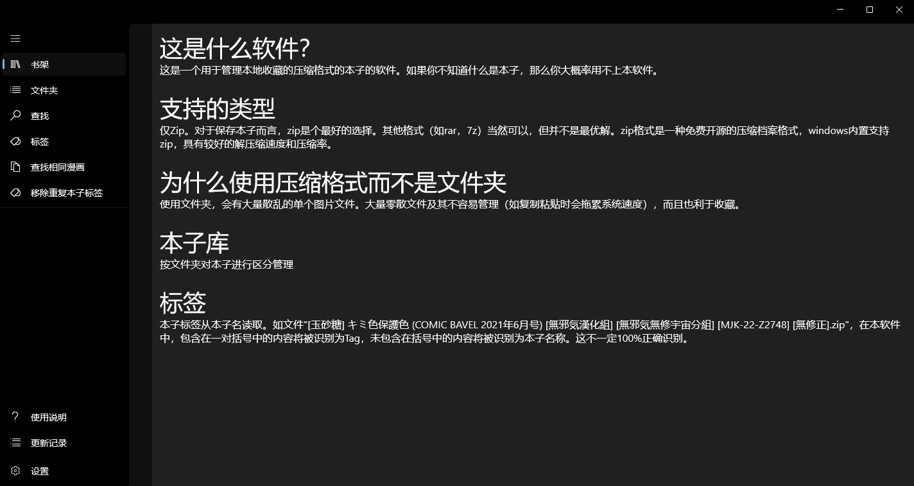
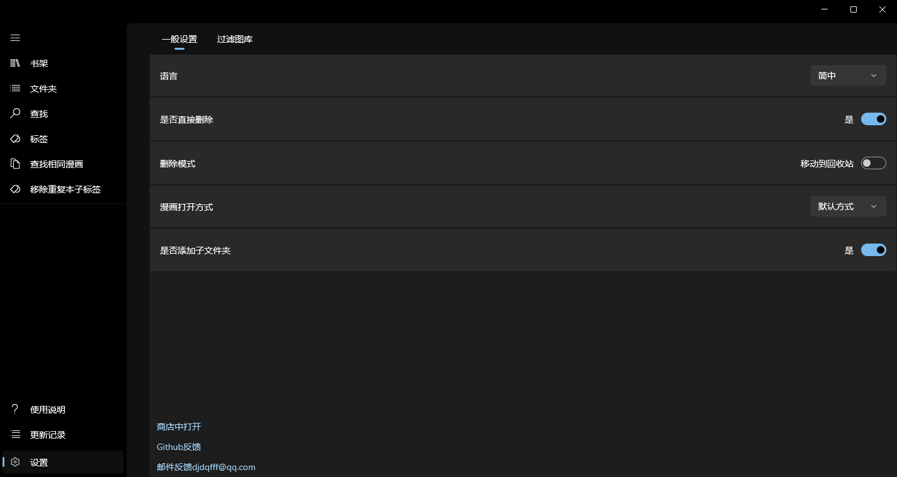
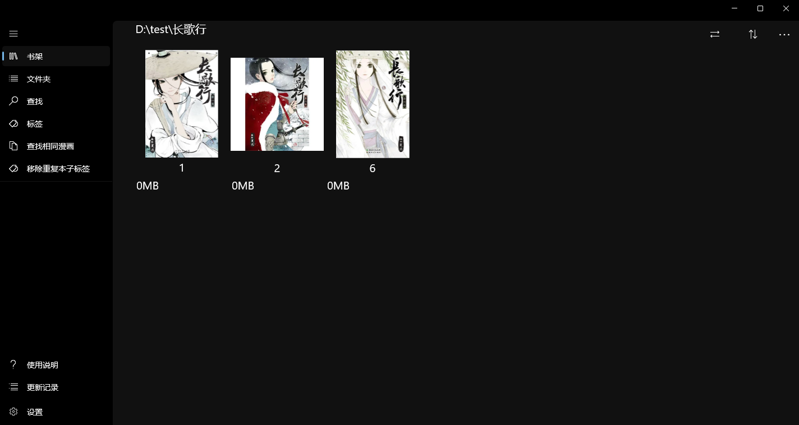
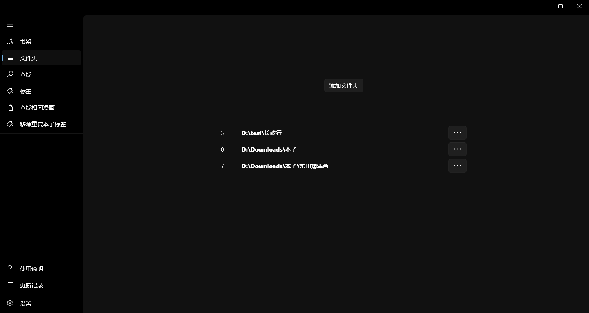

# 本子管理器 / EroMangaManager

## 自用软件，无偿分享。有爱自取，不喜勿喷。

此为WinAppSdk/WinUI3版本。有一个UWP版本和一个UWP/WinUI3版本，皆已存档。

此仓库为根仓库，克隆此仓库时带子模块即可。
开发、打包、发布皆使用本地设备，github仅用作备份。
无意义commit较多，协同开发较混乱。

Release页面由本地发布，非workflow自动执行。
（也有workflow流程，但github action 调试太痛苦，故弃止不用）

此处截图功能不全，仅用于Microsoft商店发布提交

Microsoft商店可下载：[本子管理器| Microsoft Store](https://apps.microsoft.com/detail/9N7C8ZDQ1TJ8?hl=zh-cn&gl=CN&ocid=pdpshare)

Apk文件为配合本体使用的简单远程（局域网192.168内）使用，在软件内开启服务。
未在安卓商店发布。

